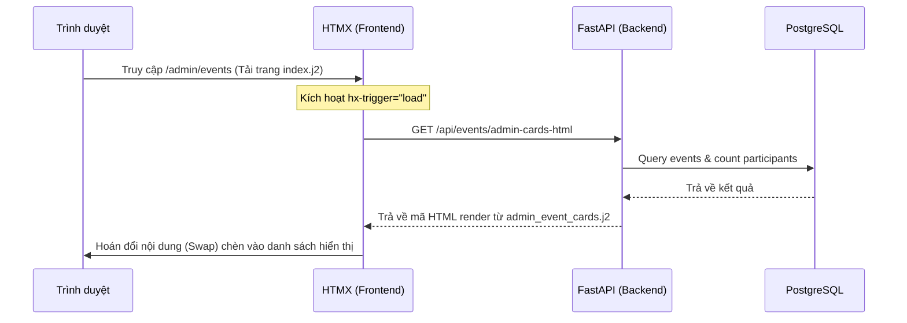

# Tài liệu Chi tiết Module Sự kiện (Events Module)

Tài liệu này cung cấp cái nhìn chi tiết về kiến trúc, cấu trúc file, luồng hoạt động, cách gọi API và cách xử lý sự kiện trong **Module Sự kiện** của dự án.

---

## 1. Cấu trúc các File liên quan

Dưới đây là sơ đồ cây các file thuộc module sự kiện và vai trò của từng file:

```text
event-tracking-system/
├── database/
│   └── models/
│       └── events.py            # Khai báo cấu trúc bảng cơ sở dữ liệu `events` (SQLModel)
├── src/
│   ├── modules/
│   │   └── events/
│   │       ├── views/           # Chứa các giao diện HTML (Jinja2 Templates)
│   │       │   ├── index.j2             # Trang quản lý admin và các Modals thêm/sửa/xóa
│   │       │   ├── admin_event_cards.j2  # Grid hiển thị thẻ sự kiện trong trang Admin
│   │       │   └── event_cards.j2        # Grid hiển thị thẻ sự kiện cho trang chủ công cộng
│   │       │   └── event_views.py       # Render file index.j2 tại route `/admin/events`
│   │       ├── event_apis.py    # Định nghĩa các endpoints RESTful API
│   │       ├── event_services.py# Xử lý các logic nghiệp vụ (CRUD) tương tác với Database
│   │       ├── event_schemas.py # Định nghĩa kiểu dữ liệu đầu vào/đầu ra (Pydantic models)
│   │       └── event_constants.py
│   └── static/
│       └── css/
│           └── admin_events.css # Stylesheet giao diện admin, responsive & light/dark modes
```

---

## 2. Luồng hoạt động & Xử lý sự kiện (Workflow)

Hệ thống kết hợp giữa **FastAPI (Backend)**, **Jinja2 (Template)**, **HTMX (Tải dữ liệu không reload)** và **Alpine.js (Xử lý giao diện tương tác và Modals)**.

### A. Luồng tải danh sách sự kiện (Read)


### B. Luồng Tìm kiếm sự kiện (Search)
1. Người dùng nhập văn bản vào thanh tìm kiếm.
2. Alpine.js lưu vào biến `search` (`x-model="search"`).
3. Sau 300ms dừng gõ (`debounce.300ms`), Alpine phát sự kiện `$dispatch('search-changed')`.
4. Thẻ container HTMX bắt được sự kiện này (`hx-trigger="search-changed from:body"`).
5. HTMX gửi request `GET /api/events/admin-cards-html?search={từ_khóa}`.
6. Server lọc dữ liệu trong DB và trả về HTML chứa danh sách thẻ đã lọc.

### C. Luồng Tạo sự kiện mới (Create)
1. Người dùng bấm **Tạo sự kiện mới** -> Alpine.js đổi trạng thái `modalOpen = true` và `isEdit = false`.
2. Người dùng điền Form trong Modal và bấm **Tạo mới**.
3. JavaScript gửi một request API `POST /api/events/` dạng JSON payload.
4. Server nhận thông tin, tạo bản ghi trong DB và trả về phản hồi thành công (HTTP 201).
5. Ở Frontend, sau khi nhận kết quả thành công:
   - Hiển thị Toast thông báo thành công.
   - Đóng Modal và xóa dữ liệu form cũ.
   - Phát sự kiện lên body: `document.body.dispatchEvent(new CustomEvent('refresh-events', { bubbles: true }))`.
6. HTMX nhận biết tín hiệu `refresh-events` và tự động gửi request lấy lại danh sách mới để hiển thị lên màn hình.

### D. Luồng Xem chi tiết & Cập nhật sự kiện (Update)
1. Người dùng bấm nút **Xem chi tiết** trên thẻ sự kiện.
2. Nút bấm kích hoạt sự kiện phát đi toàn bộ dữ liệu của thẻ đó:
   ```html
   @click="$dispatch('open-edit-modal', { id, name, description, start_at, end_at, location, url_image, url_map })"
   ```
3. Bộ lắng nghe trên `index.j2` bắt lấy sự kiện, gán trạng thái `isEdit = true`, chuyển đổi định dạng ngày tháng tương thích với ô nhập `<input type="datetime-local">` và mở Modal.
4. Khi chỉnh sửa xong và nhấn **Lưu thay đổi**, Frontend gửi request `PUT /api/events/{id}` dạng JSON.
5. Server cập nhật dữ liệu, lưu vào DB và trả về HTTP 200.
6. Frontend đóng modal, hiển thị thông báo thành công và phát sự kiện `refresh-events` để cập nhật lại danh sách.

### E. Luồng Xóa sự kiện (Delete)
1. Trong giao diện Sửa, người dùng bấm **Xóa sự kiện**.
2. Alpine gọi hàm `deleteEvent()`, hiển thị hộp thoại xác nhận xóa của hệ thống (`notify.modal.confirm`).
3. Nếu đồng ý, gửi request `DELETE /api/events/{id}` lên Server.
4. Server thực hiện xóa mềm/xóa cứng bản ghi trong DB.
5. Frontend nhận phản hồi thành công, đóng modal, hiển thị thông báo và gửi tín hiệu để HTMX tải lại danh sách sự kiện mới.

---

## 3. Danh sách các API trong Module (RESTful APIs)

Tất cả các API được triển khai trong file [event_apis.py](file:///f:/Project_KienPhung/event-tracking-system/src/modules/events/event_apis.py):

| Phương thức | Đường dẫn API | Tham số đầu vào | Định dạng phản hồi | Mô tả |
| :--- | :--- | :--- | :--- | :--- |
| **POST** | `/api/events/` | JSON `EventCreateRequest` | JSON `Events` | Tạo một sự kiện mới |
| **GET** | `/api/events/` | Query `PaginationRequest` | JSON `PaginationResponse` | Lấy danh sách sự kiện dạng dữ liệu JSON phân trang |
| **GET** | `/api/events/cards-html` | Query `PaginationRequest` | **HTML** | Trả về HTML hiển thị danh sách thẻ sự kiện công cộng |
| **GET** | `/api/events/admin-cards-html` | Query `PaginationRequest` | **HTML** | Trả về HTML hiển thị danh sách thẻ sự kiện trong trang Admin |
| **GET** | `/api/events/{event_id}` | Path `{event_id: int}` | JSON `Events` | Lấy thông tin chi tiết một sự kiện theo ID |
| **PUT** | `/api/events/{event_id}` | Path `{event_id: int}`, JSON `EventUpdateRequest` | JSON `Events` | Cập nhật thông tin chi tiết sự kiện |
| **DELETE** | `/api/events/{event_id}` | Path `{event_id: int}` | JSON | Xóa sự kiện khỏi cơ sở dữ liệu |
| **POST** | `/api/events/{event_id}/register` | Path `{event_id}`, Query `employee_id` | JSON | Đăng ký một nhân viên tham gia sự kiện |

---

## 4. Hướng dẫn chạy & Kiểm tra tính năng

### Bước 1: Đồng bộ hóa cấu trúc Database
Vì mô hình cơ sở dữ liệu đã được thêm trường `location`, bạn cần làm sạch và nạp lại cấu trúc DB mới bằng cách chạy lệnh này trong terminal:
```powershell
.\envs\python.exe -m database.seeds.seed_db
```
*(Lệnh này sẽ tự động xóa bảng cũ, tạo bảng mới có cột location, nạp tài khoản admin cùng 3 sự kiện mẫu).*

### Bước 2: Đồng bộ hóa Alembic
```powershell
.\envs\python.exe -m alembic stamp head
```

### Bước 3: Khởi chạy Server
```powershell
.\envs\python.exe -m src.main
```

Sau khi chạy xong, hãy đăng nhập bằng tài khoản Admin mặc định (`admin` / `Admin123@`) và truy cập vào địa chỉ `http://localhost:8000/admin/events` để kiểm tra.

---

## 5. Giải thích chi tiết mã nguồn & Luồng xử lý từng dòng (Line-by-line Code Flow)

Dưới đây là mô tả chi tiết từng dòng code điều khiển các luồng **Xem chi tiết**, **Cập nhật** và **Xóa** sự kiện.

### A. Luồng Xem chi tiết (View Details)

Luồng này truyền dữ liệu của sự kiện từ thẻ (Card) HTML được render từ Backend vào Modal điền Form bằng cơ chế **Alpine.js Custom Events**.

#### Bước 1: Nút bấm trên thẻ sự kiện phát ra dữ liệu
Tại file [admin_event_cards.j2](file:///f:/Project_KienPhung/event-tracking-system/src/modules/events/views/admin_event_cards.j2):
```html
<button type="button" class="btn-view-details" 
    @click="$dispatch('open-edit-modal', {
        id: {{ event.id }},
        name: '{{ event.name | escape }}',
        description: '{{ (event.description or "") | escape }}',
        start_at: '{{ event.start_at.isoformat() if event.start_at else "" }}',
        end_at: '{{ event.end_at.isoformat() if event.end_at else "" }}',
        location: '{{ (event.location or "") | escape }}',
        url_image: '{{ (event.url_image or "") | escape }}',
        url_map: '{{ (event.url_map or "") | escape }}'
    })">
    Xem chi tiết
</button>
```
* `@click`: Sự kiện click chuột của Alpine.js.
* `$dispatch('open-edit-modal', { ... })`: Phát ra một custom event tên là `open-edit-modal` lên phạm vi toàn cục (`window`), đính kèm một payload JSON chứa các thông tin của sự kiện được lấy trực tiếp từ đối tượng `event` thông qua cú pháp Jinja2 (`{{ event.name }}`).
* `| escape`: Đảm bảo các chuỗi ký tự đặc biệt (như dấu nháy) không làm vỡ cú pháp JavaScript của thẻ.

#### Bước 2: Trang chính lắng nghe sự kiện và bắt lấy dữ liệu
Tại file [index.j2](file:///f:/Project_KienPhung/event-tracking-system/src/modules/events/views/index.j2):
```html
<div class="admin-events-container" x-data="adminEventsApp()" @open-edit-modal.window="openEditModal($event.detail)">
```
* `@open-edit-modal.window="..."`: Lắng nghe sự kiện `open-edit-modal` trên đối tượng `window` toàn cục.
* `openEditModal($event.detail)`: Khi bắt được sự kiện, gọi hàm `openEditModal` của ứng dụng và truyền dữ liệu payload (`$event.detail`) vào làm tham số.

#### Bước 3: Hàm xử lý mở Modal và điền Form
Trong block `<script>` của [index.j2](file:///f:/Project_KienPhung/event-tracking-system/src/modules/events/views/index.j2):
```javascript
openEditModal(data) {
    this.isEdit = true;
    this.currentEventId = data.id;
    this.form = {
        name: data.name || '',
        description: data.description || '',
        location: data.location || '',
        start_at: this.formatDateTimeForInput(data.start_at),
        end_at: this.formatDateTimeForInput(data.end_at),
        url_image: data.url_image || '',
        url_map: data.url_map || ''
    };
    this.modalOpen = true;
}
```
* `this.isEdit = true`: Đánh dấu trạng thái đang sửa (Modal sẽ đổi tiêu đề thành "Cập nhật sự kiện" và hiển thị nút **Xóa sự kiện**).
* `this.currentEventId = data.id`: Lưu giữ ID của sự kiện hiện tại để làm cơ sở gửi request PUT (Cập nhật) hoặc DELETE (Xóa) sau đó.
* `this.formatDateTimeForInput(...)`: Định dạng chuỗi thời gian ISO thành định dạng `YYYY-MM-DDTHH:MM` để hiển thị khớp với thẻ `<input type="datetime-local">` trên trình duyệt.
* `this.modalOpen = true`: Hiển thị Modal lên màn hình.

---

### B. Luồng Cập nhật sự kiện (Update)

Luồng này thu thập thông tin chỉnh sửa từ Form, chuyển đổi định dạng và gửi request PUT lên Backend thông qua Fetch API.

#### Bước 1: Khởi kích hoạt khi Submit Form
Tại file [index.j2](file:///f:/Project_KienPhung/event-tracking-system/src/modules/events/views/index.j2):
```html
<form @submit.prevent="saveEvent()">
```
* `@submit.prevent`: Lắng nghe sự kiện submit form và ngăn hành vi mặc định của trình duyệt (tránh reload lại toàn bộ trang), sau đó kích hoạt hàm `saveEvent()`.

#### Bước 2: Hàm gửi dữ liệu lên Backend
Trong block `<script>` của [index.j2](file:///f:/Project_KienPhung/event-tracking-system/src/modules/events/views/index.j2):
```javascript
async saveEvent() {
    this.isLoading = true;
    const url = this.isEdit ? `/api/events/${this.currentEventId}` : '/api/events/';
    const method = this.isEdit ? 'PUT' : 'POST';

    const payload = {
        ...this.form,
        start_at: this.form.start_at ? new Date(this.form.start_at).toISOString() : null,
        end_at: this.form.end_at ? new Date(this.form.end_at).toISOString() : null,
        url_image: this.form.url_image || null,
        url_map: this.form.url_map || null
    };

    const response = await fetch(url, {
        method: method,
        headers: { 'Content-Type': 'application/json' },
        body: JSON.stringify(payload)
    });
    ...
    if (response.ok) {
        notify.toast.success('Cập nhật thành công');
        this.modalOpen = false;
        document.body.dispatchEvent(new CustomEvent('refresh-events', { bubbles: true }));
    }
}
```
* `const url = ...`, `const method = ...`: Nếu `isEdit` là `true`, thiết lập gửi request đến đường dẫn `/api/events/{id}` bằng phương thức `PUT`.
* `.toISOString()`: Chuyển đổi định dạng giờ địa phương ngược về giờ chuẩn UTC (dạng ISO 8601) để lưu vào cơ sở dữ liệu.
* `fetch(...)`: Thực hiện request Ajax gửi dữ liệu JSON lên server.
* `document.body.dispatchEvent(...)`: Sau khi nhận tín hiệu thành công từ server, phát sự kiện `refresh-events` lên phần tử body (có chế độ sủi bọt bubbles: true) để HTMX tự động bắt lấy và gọi lại API lấy danh sách sự kiện mới.

#### Bước 3: Backend xử lý và cập nhật cơ sở dữ liệu
Tại file [event_apis.py](file:///f:/Project_KienPhung/event-tracking-system/src/modules/events/event_apis.py):
```python
@router.put_api("{event_id}")
async def update_event(self, event_id: int, event: EventUpdateRequest):
    return await self.service.update_event(event_id, event)
```
* FastAPI nhận request và tự động ép kiểu/kiểm tra dữ liệu (validation) đầu vào dựa trên Pydantic Model `EventUpdateRequest`. Sau đó chuyển tiếp sang tầng Service.

Tại file [event_services.py](file:///f:/Project_KienPhung/event-tracking-system/src/modules/events/event_services.py):
```python
async def update_event(self, event_id: int, event_data: EventUpdateRequest) -> BaseResponse[Events]:
    db_obj = await self.crud.find_by_id(event_id)
    if db_obj is None:
        return BaseResponse.not_found(message="Không tìm thấy sự kiện")

    update_dict = event_data.model_dump(exclude_unset=True)
    for key, value in update_dict.items():
        setattr(db_obj, key, value)

    self.session.add(db_obj)
    await self.session.commit()
    await self.session.refresh(db_obj)
    return BaseResponse.ok(db_obj, message="Cập nhật sự kiện thành công")
```
* `find_by_id(event_id)`: Tìm đối tượng sự kiện hiện tại trong Database PostgreSQL.
* `model_dump(exclude_unset=True)`: Chuyển payload đầu vào thành dictionary, chỉ lấy các trường mà người dùng thực sự gửi lên chỉnh sửa (tránh ghi đè các trường khác thành `None`).
* `setattr(...)`: Cập nhật các trường dữ liệu mới cho đối tượng ORM.
* `session.commit()`: Thực thi lệnh cập nhật xuống DB thực tế và kết thúc transaction.

---

### C. Luồng Xóa sự kiện (Delete)

Luồng này xác nhận hành vi xóa của người dùng và gọi API DELETE để xóa sự kiện khỏi hệ thống.

#### Bước 1: Gọi hàm từ giao diện
Tại file [index.j2](file:///f:/Project_KienPhung/event-tracking-system/src/modules/events/views/index.j2):
```html
<button type="button" class="btn-modal-danger" @click="deleteEvent()" :disabled="isLoading">
    Xóa sự kiện
</button>
```
* Nút bấm chỉ hiển thị khi `isEdit` là `true`. Khi bấm, gọi hàm `deleteEvent()`.

#### Bước 2: Hàm thực hiện xác nhận và gửi request xóa
Trong block `<script>` của [index.j2](file:///f:/Project_KienPhung/event-tracking-system/src/modules/events/views/index.j2):
```javascript
async deleteEvent() {
    if (!this.currentEventId) return;

    const confirmed = await notify.modal.confirm(
        'Xóa sự kiện?',
        `Bạn có chắc chắn muốn xóa sự kiện "${this.form.name}" không?`
    );

    if (!confirmed) return;

    this.isLoading = true;
    const response = await fetch(`/api/events/${this.currentEventId}`, {
        method: 'DELETE'
    });
    ...
    if (response.ok) {
        notify.toast.success('Xóa sự kiện thành công');
        this.modalOpen = false;
        document.body.dispatchEvent(new CustomEvent('refresh-events', { bubbles: true }));
    }
}
```
* `notify.modal.confirm(...)`: Chờ hộp thoại xác nhận (được triển khai bằng Promise). Nếu chọn đồng ý, biến `confirmed` nhận giá trị `true`.
* `fetch(...)`: Thực hiện request Ajax với phương thức `DELETE` gửi tới `/api/events/{id}`.
* Phát ra sự kiện `refresh-events` để báo hiệu cho HTMX cập nhật danh sách thẻ sự kiện, loại bỏ thẻ đã bị xóa khỏi màn hình.

#### Bước 3: Backend xóa sự kiện
Tại file [event_apis.py](file:///f:/Project_KienPhung/event-tracking-system/src/modules/events/event_apis.py):
```python
@router.delete_api("{event_id}")
async def delete_event(self, event_id: int):
    return await self.service.delete_event(event_id)
```

Tại file [event_services.py](file:///f:/Project_KienPhung/event-tracking-system/src/modules/events/event_services.py):
```python
async def delete_event(self, event_id: int) -> BaseResponse:
    deleted = await self.crud.select(Events).where(Events.id == event_id).delete()
    if not deleted:
        return BaseResponse.not_found(message="Không tìm thấy sự kiện")
    return BaseResponse.ok(message="Xóa sự kiện thành công")
```
* `delete()`: Thực hiện câu lệnh SQL `DELETE FROM events WHERE id = event_id` thông qua SQLAlchemy để xóa bỏ bản ghi sự kiện ra khỏi Database.

---

## 6. Hướng dẫn quy trình tìm và gỡ lỗi (Debugging Guide - Step-by-Step)

Dưới đây là quy trình từng bước (Step-by-step) đã được áp dụng để phát hiện và xử lý lỗi không hiển thị danh sách và lỗi tìm kiếm (Search), bạn có thể tự mình áp dụng quy trình này để xử lý các lỗi phát sinh sau này:

### Bước 1: Kiểm tra phản hồi thực tế của API (API Response Check)
Khi giao diện (Frontend) hiển thị không đúng hoặc trống trơn, bước đầu tiên là phải kiểm tra xem **Backend trả về dữ liệu gì**.

* **Cách thực hiện**:
  * Mở **Developer Tools** trên trình duyệt (F12) -> Chuyển sang tab **Network** -> Thực hiện thao tác (gõ tìm kiếm/reload) -> Click vào request API tương ứng để xem phần **Response** (Phản hồi).
  * Hoặc chạy lệnh `curl` trực tiếp trong terminal để kiểm tra nhanh:
    ```powershell
    curl.exe -i "http://localhost:8000/api/events/admin-cards-html?search=Team"
    ```
* **Cách phân tích kết quả**:
  * **Nếu lỗi HTTP 422 (Unprocessable Entity)**: Đây là lỗi định dạng dữ liệu truyền lên. Hãy đọc kỹ phần JSON lỗi trả về để xem trường nào bị sai ràng buộc (Ví dụ lỗi: `"Input should be greater than 1"` của tham số `page` do khai báo `gt=1` nhầm trong schema).
  * **Nếu trả về HTTP 200 nhưng dữ liệu trống/sai lệch**: Đây là lỗi logic xử lý ở Backend hoặc truy vấn Database. Hãy chuyển sang **Bước 2**.

---

### Bước 2: Kiểm tra câu lệnh SQL thực tế được thực thi (SQL Logging Check)
Khi logic Backend bị sai hoặc trả về sai dữ liệu, hãy xem câu lệnh SQL mà thư viện ORM (SQLAlchemy/SQLModel) dịch ra để gửi xuống cơ sở dữ liệu.

* **Cách thực hiện**:
  * Nhìn vào cửa sổ Terminal đang chạy ứng dụng (`src.main`). SQLAlchemy đã được cấu hình in (log) câu lệnh SQL thời gian thực khi có request.
  * Hãy tìm khối lệnh có dạng `SELECT ... FROM events ...` được in ra khi bạn thực hiện tìm kiếm hoặc tải trang.
* **Cách phân tích kết quả**:
  * Hãy soi kỹ điều kiện `WHERE` trong câu lệnh SQL.
  * *Ví dụ thực tế*: Khi gõ tìm kiếm từ khóa `"Team"`, SQL log in ra:
    ```sql
    WHERE events.deleted_at IS NULL GROUP BY events.id ...
    ```
    Nhận xét: Hoàn toàn không có điều kiện `WHERE events.name ILIKE '%Team%'`. Điều này chứng tỏ **Backend đã bỏ qua từ khóa tìm kiếm** hoặc code tạo điều kiện `WHERE` trong Python đã bị chạy sai luồng nhánh `if/else`. Hãy chuyển sang **Bước 3**.

---

### Bước 3: Viết mã thử nghiệm độc lập (Scratch Script Testing)
Khi nghi ngờ một hàm logic phức tạp hoặc nghi ngờ cơ chế tự động của thư viện (như cách kiểm tra kiểu cột `isinstance(column.type, String)`), cách nhanh nhất là viết một file kiểm thử nhỏ để chạy độc lập.

* **Cách thực hiện**:
  * Tạo một file Python tạm thời (ví dụ: `src/test_search.py`) chỉ chứa đoạn mã cần kiểm tra:
    ```python
    from database.models.events import Events
    from sqlalchemy import String
    
    for column in Events.__table__.columns:
        print(f"Cột: {column.name}, Kiểu: {column.type}, Trùng khớp String: {isinstance(column.type, String)}")
    ```
  * Chạy file này bằng trình thông dịch của dự án để đảm bảo môi trường đồng nhất:
    ```powershell
    .\envs\python.exe -m src.test_search
    ```
* **Cách phân tích kết quả**:
  * Kết quả chạy script in ra: `Cột: name, Kiểu: VARCHAR(300), Trùng khớp String: False`.
  * Từ đây, chúng ta phát hiện ngay thủ phạm: SQLModel sử dụng lớp kiểu dữ liệu tự định nghĩa tên là `AutoString`. Lớp này không thừa kế từ `String` của SQLAlchemy nên hàm `isinstance` trả về `False` và bỏ qua cột này khi tìm kiếm.
  * Sau khi kiểm tra xong, hãy xóa file test để giữ sạch cây mã nguồn:
    ```powershell
    Remove-Item src/test_search.py
    ```

---

### Bước 4: Sử dụng VS Code Debugger để khoanh vùng lỗi trực quan
Nếu các bước trên chưa làm rõ được lỗi, hãy sử dụng tính năng Debug của VS Code để theo dõi sự thay đổi của biến số qua từng dòng code.

* **Cách thực hiện**:
  1. Tắt server ở terminal thường (Ctrl + C).
  2. Click vào lề trái số dòng code để đặt dấu chấm đỏ (Breakpoint) tại điểm nghi ngờ (ví dụ: dòng nhận tham số ở `event_apis.py` hoặc dòng bắt đầu lọc trong `base_crud.py`).
  3. Nhấn phím **`F5`** để khởi chạy chế độ Debug.
  4. Thực hiện thao tác trên giao diện trình duyệt để trigger đoạn code chạy qua điểm dừng.
* **Cách phân tích**:
  * Chương trình sẽ dừng lại tại dòng có chấm đỏ.
  * Bạn rê chuột lên các biến trong VS Code hoặc xem bảng **Variables** ở bên trái để theo dõi giá trị hiện tại của biến, từ đó phát hiện nhánh `if/else` nào đang bị rẽ sai hướng.


